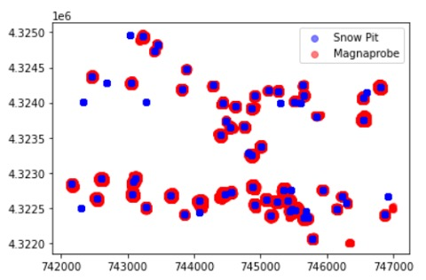

# coldfusion
Thanks to Lindsey Heagey and Joachim Meyer for the README template!

## Project summary of coldfusion
*coldfusion* is a team effort to merge and validate overlapping GPR and LiDAR datasets using `Python`, `Git/Github` and `JupyterLab` during [SnowEx Hackweek 2022](https://snowex.hackweek.io/intro.html). The [2020 NASA SnowEx campaign](https://nsidc.org/data/snowex) collected a variety of high-spatial resolution snow depth information using GPR, magnaprobe depth measurements, snow pit densities and LiDAR point clouds between January 29th and February 6th 2020 in the Grand Mesa study area. 

Depth from LiDAR and density from GPR are compiled and then validated against snowpit density/SWE values to 'close the loop'.

.jpe



### `Collaborators on this project`
- Curtis Beutler [CBeutler](https://github.com/CBeutler)
- Peter Marshall [pmarshall24](https://github.com/pmarshall24)
- Tate Meehan [tatemeehan](https://github.com/tatemeehan)
- Kori Mooney [korimooney](https://github.com/korimooney)
- Alicia Pouw [aliciapouw21](https://github.com/aliciapouw21)
- Thomas Van Der Weide [tvanderweide](https://github.com/tvanderweide)
- Megan Verfaillie [Megan-Verf](https://github.com/Megan-Verf)
- Seth Vanderwilt [sethv](https://github.com/sethv)

### `Database information`
SiteData
: snowpit information and metadata

PointData
: GPR data, snow probes [('depth',),('swe'),('two_way_travel',)]

ImageData
: LiDAR ASO data

LayerData 
: snow pit data (density, depth)

### `Tasks`
- [x] Find LiDAR area with GPR validation data in western and central Grand Mesa study area and create code to query data from database. 
Validate using:
    - Snow pits (Snow depths & Density)
    - Magnaprobe (snow depth)
    - SNOTEL (snow depth) [Mesa Lakes (622)](https://wcc.sc.egov.usda.gov/nwcc/site?sitenum=622&state=co)
- [ ] Ensure GPR & LiDAR are on like coordinate systems and co-locate GPR points to LiDAR points
- [ ] Calculate snow density using dielectric permittivity and wave speed using LiDAR snow depths.
- [ ] Validate by co-locating in-situ snow density and snow depth
- [ ] Machine Learning
- [ ] Look at other sites

### `Density calcs`
$\rho = \frac{z}{SWE}$
eq. 1 density based on ASO snow depth and SWE

### `Next steps`
Application of Machine Learning to begin looking at other study sites

### `Application example`

List one specific application of this work.

### `Sample data`

If you already have some data to explore, briefly describe it here (size, format, how to access).

### `Existing methods`

How would you or others traditionally try to address this problem?

### `Proposed methods/tools`

Building from what you learn at this hackweek, what new approaches would you like to try to implement?

### `Background reading`

Optional: links to manuscripts or technical documents for more in-depth analysis.

## Files

* `.gitignore`
<br> Globally ignored files by `git` for the project.
* `environment.yml`
<br> `conda` environment description needed to run this project.
* `README.md`
<br> Description of the project (see suggested headings below)

## Folders

### `contributors`
Each team member has their own folder under contributors, where they can work on their contribution to the project. Having a dedicated folder for each person prevents conflicts when merging with the main branch.

### `notebooks`
Notebooks that are considered delivered results for the project should go in here.

### `scripts`
Helper utilities that are shared with the team

# Table of Variables
| SiteData Columns | PointData Columns | ImageData Columns | LayerData Columns
| ----------- | ----------- | ----------- | ----------- |
| air_temp | date | date | bottom_depth |
| aspect | date_accessed | date accessed | comments |
| date | doi | description | date |
| date_accessed | easting | doi | date_accessed |
| doi | elevation | instrument | depth |
| easting | equipment | metadata | doi |
| elevation | geom | observers | easting |
| geom | instrument | raster | elevation |
| ground_condition | latitude | registry | flags|
| ground_roughness | longitude | site_name | geom |
| ground_vegetation | metadata | time_created | instrument |
| latitude | northing | time_updated | latitude |
| longitude | observers | type | longitude |
| metadata | registry | units | metadata|
| northing | site_id | ----------- | northing |
| pit_id | site_name | ----------- | observers |
| precip | time | ----------- | pit_id |
| registry | time | ----------- | registry |
| site_id | time_updated | ----------- | sample_a |
| site_name | type | ----------- | sample_b |
| site_notes | units | ----------- | sample_c |
| sky_cover | utm_zone | ----------- | site_id |
| slope_angle | value | ----------- | site_name|
| time | version_number | ----------- | time |
| time_created | ----------- | ----------- | time_created |
| time_updated | ----------- | ----------- | time_updated |
| total_depth | ----------- | ----------- | type |
| tree_canopy | ----------- | ----------- | units |
| utm_zone | ----------- | ----------- | utm_zone |
| vegetation_height | ----------- | ----------- | value |
| weather_description | ----------- | ----------- | ----------- |
| wind | ----------- | ----------- | ----------- |

# Fenced Code Block
```
{
  "firstName": "John",
  "lastName": "Smith",
  "age": 25
}
```
